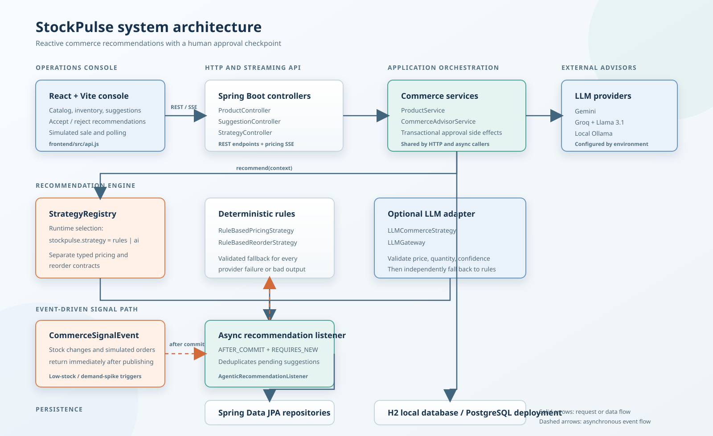

# StockPulse

StockPulse is a reactive commerce advisor for inventory-aware pricing and replenishment. The first sprint covers the inventory signal -> AI or rules recommendation -> human approval loop.

## Requirements captured from the brief

### Required stack

- Backend: Java 17+, Spring Boot 3.x, Maven, Spring Data JPA, Bean Validation, H2 for local development or PostgreSQL for deployment.
- Frontend: React 18 with Vite. Angular 17 was an alternative in the brief; React was selected and recorded in `ADR.md`.
- LLM provider: configurable Gemini, Groq with Llama 3.1, or local Ollama. No API key is committed.
- Local CORS: `http://localhost:5173` and `http://localhost:4200`.

### Domain and state requirements

- `Product`: SKU, name, category (`ELECTRONICS`, `APPAREL`, `HOME`), current price, stock level, reorder threshold, demand velocity, lifecycle status, and nullable extension fields such as `costPrice` and `supplierId`.
- `PricingSuggestion`: product, current and recommended price, direction (`INCREASE`, `DECREASE`, `HOLD`), confidence from 0.0 to 1.0, reasoning, status (`PENDING`, `ACCEPTED`, `REJECTED`), and trigger reason.
- `ReorderSuggestion`: product, current stock, recommended quantity, lead time days, confidence, reasoning, status, and trigger reason.
- Product lifecycle: `ACTIVE -> PRICE_REVIEW_PENDING -> ACTIVE`; stock level zero yields `OUT_OF_STOCK`.
- Suggestion lifecycle: `PENDING -> ACCEPTED | REJECTED`.

### Required API

- `POST /products`
- `GET /products?status=&category=`
- `PATCH /products/{id}/stock`
- `POST /products/{id}/orders`
- `POST /products/{id}/suggest-pricing`
- `POST /products/{id}/suggest-reorder`
- `PATCH /pricing-suggestions/{id}`
- `PATCH /reorder-suggestions/{id}`
- Optional bonus: `POST /products/{id}/suggest-pricing/stream` using SSE.

### Commerce behavior

- Use a strategy contract shared by HTTP requests and asynchronous event handlers.
- Rule pricing: stock below threshold -> 10% increase; demand velocity above 2x category average -> 5% increase; otherwise hold.
- Rule reorder: `(reorder threshold * 3) - current stock`, minimum 1.
- Switch the active strategy by configuration at runtime without a restart.
- AI receives product context, category average, velocity, and distinct low-stock or demand-spike trigger context.
- Validate positive prices, sane price bounds, positive integer reorder quantities, confidence bounds, malformed responses, quota errors, and timeouts. Fall back to rules.

### Agentic loop

- Stock updates and simulated orders return immediately.
- Low stock or demand spike publishes an asynchronous recommendation job.
- Each trigger creates both pricing and reorder suggestions.
- Do not create duplicate pending suggestions for the same product, trigger reason, and suggestion type.
- Accepting pricing atomically updates `currentPrice`; accepting reorder atomically increments stock.
- Human approval is the checkpoint. Suggestions never publish automatically in sprint 1.

### Console and delivery

- Show product stock, price, velocity, and lifecycle status.
- Show pending pricing and reorder suggestions with confidence, reasoning, and trigger badges.
- Provide accept/reject for both types, a simulate-sale action, refresh or polling, loading, and error states.
- Optional ceiling: catalog board, margins, price history, category filtering, and stock heatmap.
- Required deliverables: public GitHub repository, this `README.md`, `ADR.md`, and a five-minute demo showing the inventory-low path.

## Project layout

```text
StockPulse/
|-- .env.example                  Local LLM and application environment template
|-- .gitignore                    Git exclusions for secrets and generated files
|-- ADR.md                        Architecture decisions and deliberate exclusions
|-- README.md                     Project requirements, setup, and API overview
|-- start.sh                      Starts the backend and frontend together
|-- stockpulse-brief 1.html       Original product brief
|
|-- backend/                      Spring Boot API and commerce domain
|   |-- pom.xml                   Maven build and dependency configuration
|   |-- src/
|       |-- main/
|       |   |-- java/com/stockpulse/
|       |   |   |-- StockPulseApplication.java
|       |   |   |-- api/          REST controllers, DTOs, services, and errors
|       |   |   |   |-- ApiDtos.java
|       |   |   |   |-- ApiExceptionHandler.java
|       |   |   |   |-- CommerceSignalEvent.java
|       |   |   |   |-- ProductController.java
|       |   |   |   |-- ProductService.java
|       |   |   |   |-- StrategyController.java
|       |   |   |   |-- SuggestionController.java
|       |   |   |   `-- package-info.java
|       |   |   |-- advisor/      Pricing, reorder, and LLM strategy contracts
|       |   |   |   |-- CommerceAdvisorService.java
|       |   |   |   |-- CommerceContext.java
|       |   |   |   |-- LLMCommerceStrategy.java
|       |   |   |   |-- LLMGateway.java
|       |   |   |   |-- LLMReorderStrategy.java
|       |   |   |   |-- PricingRecommendation.java
|       |   |   |   |-- PricingStrategy.java
|       |   |   |   |-- ReorderRecommendation.java
|       |   |   |   |-- ReorderStrategy.java
|       |   |   |   |-- RuleBasedPricingStrategy.java
|       |   |   |   |-- RuleBasedReorderStrategy.java
|       |   |   |   |-- StrategyRegistry.java
|       |   |   |   `-- package-info.java
|       |   |   |-- config/       CORS, seed data, and asynchronous listeners
|       |   |   |   |-- AgenticRecommendationListener.java
|       |   |   |   |-- CorsConfig.java
|       |   |   |   |-- SeedData.java
|       |   |   |   `-- package-info.java
|       |   |   |-- domain/       JPA entities, enums, and repositories
|       |   |   |   |-- Category.java
|       |   |   |   |-- ChangeDirection.java
|       |   |   |   |-- PricingSuggestion.java
|       |   |   |   |-- PricingSuggestionRepository.java
|       |   |   |   |-- Product.java
|       |   |   |   |-- ProductRepository.java
|       |   |   |   |-- ProductStatus.java
|       |   |   |   |-- ReorderSuggestion.java
|       |   |   |   |-- ReorderSuggestionRepository.java
|       |   |   |   |-- SuggestionStatus.java
|       |   |   |   |-- TriggerReason.java
|       |   |   |   `-- package-info.java
|       |   |   `-- resources/
|       |   |       `-- application.yml  Spring profiles and runtime settings
|       |   `-- test/java/com/stockpulse/
|       |       |-- CommerceWalkthroughTest.java  End-to-end commerce flow
|       |       `-- advisor/LLMStrategyTest.java  LLM parsing and fallback tests
|
`-- frontend/                     React 18 + Vite merchandising console
	|-- package.json               Frontend scripts and dependencies
	|-- package-lock.json          Locked npm dependency versions
	|-- vite.config.js             Vite development-server configuration
	|-- index.html                 Browser entry document
	`-- src/
		|-- main.jsx               React application bootstrap
		|-- App.jsx                Console views and user interactions
		|-- api.js                 Backend API client
		`-- styles.css             Application layout and visual styles
```

Generated directories such as `backend/target/` and `frontend/node_modules/` are intentionally omitted from this tree. They are created by Maven and npm during development and are excluded from version control.

## System architecture



The React console communicates with the Spring Boot API over REST and pricing SSE. Product stock changes and simulated orders publish `CommerceSignalEvent` after the current transaction commits. `AgenticRecommendationListener` handles each signal asynchronously, prevents duplicate pending suggestions, and delegates pricing and reorder work to the shared `CommerceAdvisorService`.

`StrategyRegistry` selects the active rules or AI implementation at runtime. The optional LLM adapter validates provider responses and independently falls back to deterministic rules when a provider is unavailable or returns unsafe output. Suggestions are stored through Spring Data JPA and remain pending until a human accepts or rejects them; accepted pricing and replenishment changes are applied transactionally.

## Run locally

Run the services individually in two terminals.

Terminal 1, backend with the AI strategy from Git Bash or WSL:

```text
cd /c/Users/zycus/Desktop/Omkar_AI
set -a
source .env
set +a
cd backend
mvn spring-boot:run "-Dspring-boot.run.arguments=--stockpulse.strategy=ai"
```

The rule-based backend can be started without the `.env` values:

```text
cd backend
mvn spring-boot:run "-Dspring-boot.run.arguments=--stockpulse.strategy=rules"
```

Terminal 2, frontend:

```text
cd frontend
npm.cmd install
npm.cmd run dev
```

The frontend runs at `http://localhost:5173`; the API runs at `http://localhost:8080`.

Runtime strategy switching is available without a restart:

```text
GET /settings/strategy
PATCH /settings/strategy  { "strategy": "ai" }
```

Run the full walkthrough and AI fallback tests with:

```text
cd backend
mvn test
```

The pricing stream endpoint emits `token` events for reasoning followed by a `suggestion` event. The console consumes this stream from the Suggestions view. The Products view includes category filtering and margin visibility, while Inventory includes a stock heatmap and threshold matrix.

Start both services from Git Bash or WSL:

```text
./start.sh
```

The script loads the root `.env`, starts Spring Boot and Vite together, and stops both services when the script exits. Make sure frontend dependencies are installed once with `cd frontend && npm install` before using it.

## Environment

Copy `.env.example` to a local environment if an LLM provider is enabled. The default profile is rule-based so the demo can run without credentials. Never commit `LLM_API_KEY`.
